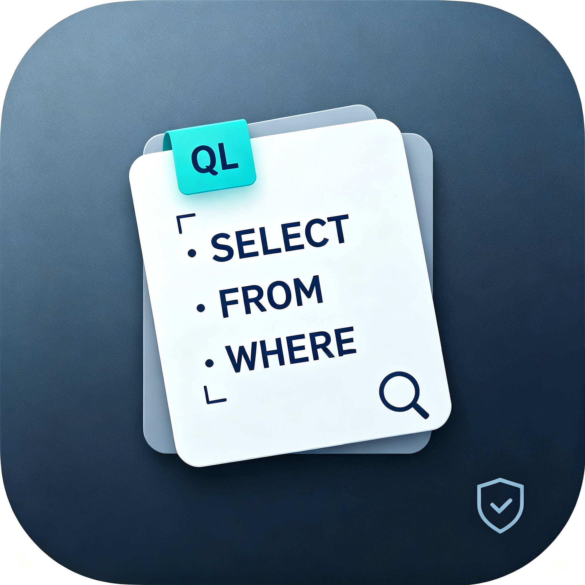

# CodeQL Assistant

<p align="center">
  
</p>

<p align="center">
  <b>跨平台 CodeQL 可视化分析工具</b><br>
  让静态代码分析更简单、更高效
</p>

<p align="center">
  <a href="#"></a>
  <a href="#"></a>
  <a href="#"></a>
  <a href="#"></a>
  <a href="#"></a>
</p>

---

## 📖 项目简介

**CodeQL Assistant** 是一款基于 [Fyne](https://fyne.io/) 框架构建的跨平台桌面 GUI 工具，旨在为安全研究人员和开发者提供直观、高效的 [CodeQL](https://codeql.github.com/) 静态代码分析体验。

本项目通过可视化的操作界面，将 CodeQL 复杂的命令行操作封装为友好的交互流程，支持数据库创建、查询分析、配置管理和历史记录追踪等核心功能。

### 核心特性

| 特性 | 描述 |
|------|------|
| 🖥️ **可视化界面** | 基于 Fyne 的现代化跨平台 GUI，支持 macOS / Linux / Windows |
| 📁 **自定义文件浏览器** | 突破系统沙盒限制，支持浏览完整文件系统，灵活选择二进制文件、查询目录和数据库路径 |
| ⚙️ **配置管理** | 支持保存/加载/删除分析配置快照，快速切换不同项目场景 |
| 📜 **历史记录** | 自动记录每次分析的运行状态、耗时和输出结果，支持一键清空 |
| 🚀 **实时输出** | 控制台实时滚动输出 CodeQL 运行日志，支持强制终止和清理 |
| 🔧 **参数灵活** | 支持自定义内存限额、线程数、输出格式及附加参数 |
| 🛡️ **进程管理** | 进程组级别的信号控制，确保子进程优雅退出 |

---

## 🏗️ 项目架构

```
codeql-assistant/
├── assets/                 # 应用资源文件（图标等）
│   ├── icon.png            # 工具图标
├── engine/                 # 核心引擎层
│   ├── config.go           # 配置模型与持久化
│   ├── history.go          # 运行历史记录管理
│   └── runner.go           # CodeQL 进程生命周期管理
├── ui/                     # 用户界面层
│   ├── app.go              # 主应用界面与事件处理
│   └── dirpicker.go        # 自定义文件/目录选择器
├── main.go                 # 程序入口
├── go.mod                  # Go 模块定义
└── go.sum                  # 依赖校验
```

### 模块职责

- **`engine/` — 核心引擎层**
  - `config.go`: 定义 `CodeQLConfig` 结构体，提供 JSON 序列化/反序列化、配置文件目录管理、预设语言与格式列表。
  - `history.go`: 线程安全的运行历史记录管理，自动持久化至 `~/.codeql-assistant/history.json`，上限 100 条。
  - `runner.go`: 封装 `codeql database analyze` 和 `codeql database create` 命令的执行逻辑，支持 context 取消、进程组信号控制和实时 stdout/stderr 输出回调。

- **`ui/` — 用户界面层**
  - `app.go`: 构建主窗口布局（配置区 / 控制台区 / 控制栏），处理所有用户交互事件（运行、停止、创建数据库、保存配置、查看历史等）。
  - `dirpicker.go`: 实现自定义目录选择器和文件选择器，支持完整文件系统导航、快捷跳转（根目录、用户主目录、桌面）和路径直接输入。

---

## 🚀 快速开始

### 环境要求

- **Go** 1.21 或更高版本
- **CodeQL CLI** — [官方安装指南](https://docs.github.com/en/code-security/codeql-cli/getting-started-with-the-codeql-cli)
- **C 编译器**（Fyne 依赖 CGO）
  - macOS: `xcode-select --install`
  - Linux: `sudo apt-get install gcc libgl1-mesa-dev xorg-dev` (Debian/Ubuntu)
  - Windows: [MinGW-w64](https://www.mingw-w64.org/)

### 安装步骤

```bash
# 1. 克隆仓库
git clone https://github.com/sh1yan/codeql-assistant.git
cd codeql-assistant

# 2. 安装依赖
go mod tidy

# 3. 编译运行
go run .

# 4. 打包发布（可选）
# macOS
fyne package -os darwin -icon assets/icon.png
# Linux
fyne package -os linux -icon assets/icon.png
# Windows
fyne package -os windows -icon assets/icon.png
```

> **提示**: 首次编译 Fyne 应用可能需要较长时间，后续构建将显著加速。

---

## 📋 使用指南

### 1. 配置分析环境

启动应用后，在 **配置区** 填写以下信息：

| 字段 | 说明 |
|------|------|
| **CodeQL 二进制文件** | CodeQL CLI 可执行文件路径（如 `/usr/local/bin/codeql`） |
| **查询 / 套件** | `.ql` 查询文件、查询套件或查询包目录路径 |
| **数据库** | CodeQL 数据库目录路径 |
| **源码根目录** | 待分析项目的源码根目录（用于创建数据库） |
| **编程语言** | 目标语言（Java、Python、Go、C/C++ 等 10 种） |
| **输出格式** | SARIF、CSV、JSON、BQRS 等 7 种格式 |
| **输出文件** | 分析结果保存路径 |
| **内存限额 / 线程数** | 控制 CodeQL 资源占用 |
| **附加参数** | 自定义 CodeQL 命令行参数（支持引号包裹含空格参数） |

### 2. 创建 CodeQL 数据库

点击 **「创建数据库」** 按钮，根据当前配置执行：
```bash
codeql database create <database-path>   --language=<language>   --source-root=<source-root>   --threads=<threads>   --ram=<ram>   --overwrite   [extra-args]
```

### 3. 运行分析

配置完成后，点击 **「开始分析」** 执行：
```bash
codeql database analyze <database-path> <query-path>   --format=<format>   --output=<output-file>   --threads=<threads>   --ram=<ram>   [extra-args]
```

控制台将实时显示运行日志，可随时点击 **「强制停止」** 终止任务。

### 4. 配置快照管理

- **保存配置**: 填写配置名称，一键保存当前所有参数至 `~/.codeql-assistant/profiles/`。
- **加载配置**: 从下拉菜单选择已保存的配置，自动回填所有字段。
- **删除配置**: 选中配置后点击删除按钮，二次确认后移除。

### 5. 查看历史记录

点击 **「历史记录」** 查看所有分析任务的运行时间、状态、耗时和输出文件，支持一键清空。

---

## ⚙️ 技术细节

### 进程生命周期管理

`runner.go` 采用以下策略确保进程可靠运行与终止：

1. **进程组隔离**: 通过 `syscall.SysProcAttr{Setpgid: true}` 创建独立进程组，确保子进程（如 Maven、编译器）可被一并终止。
2. **优雅退出**: 停止时先发送 `SIGINT`，等待 500ms 后若仍未退出则发送 `SIGKILL`。
3. **超时保护**: 进程退出等待设置 5 秒超时，防止僵尸进程。
4. **实时输出**: 通过独立 goroutine 读取 stdout/stderr，结合 `fyne.Do()` 安全更新 UI。

### 自定义文件浏览器

由于 Fyne 原生文件对话框受系统沙盒限制，`dirpicker.go` 实现了完整的文件系统浏览器：

- 支持任意路径导航（`/`、`..`、直接输入）
- 快捷跳转至根目录、用户主目录、桌面
- 文件选择器区分目录与文件，双击选中
- 目录选择器支持在当前层级直接确认

### 数据持久化

| 数据类型 | 存储路径 | 说明 |
|----------|----------|------|
| 配置文件 | `~/.codeql-assistant/profiles/*.json` | 用户保存的分析配置 |
| 历史记录 | `~/.codeql-assistant/history.json` | 最近 100 条运行记录 |
| 上次配置 | `~/.codeql-assistant/last_config.json` | 自动保存的上次运行参数 |

---

## 📦 依赖说明

| 依赖 | 版本 | 用途 |
|------|------|------|
| `fyne.io/fyne/v2` | v2.x | 跨平台 GUI 框架 |

完整依赖列表请参见 [`go.mod`](go.mod)。

---

## 🤝 贡献指南

欢迎提交 Issue 和 Pull Request！

1. Fork 本仓库
2. 创建特性分支 (`git checkout -b feature/amazing-feature`)
3. 提交更改 (`git commit -m 'Add amazing feature'`)
4. 推送分支 (`git push origin feature/amazing-feature`)
5. 创建 Pull Request

---

## 📄 许可证

本项目基于 [MIT License](LICENSE) 开源。

---

## 🙏 致谢

- [Fyne](https://fyne.io/) — 优秀的 Go 跨平台 GUI 框架
- [CodeQL](https://codeql.github.com/) — GitHub 开源的静态代码分析引擎
- [Go](https://go.dev/) — 简洁高效的编程语言

---

<p align="center">
  Made with ❤️ by <a href="https://github.com/yourusername">shiyan</a>
</p>
